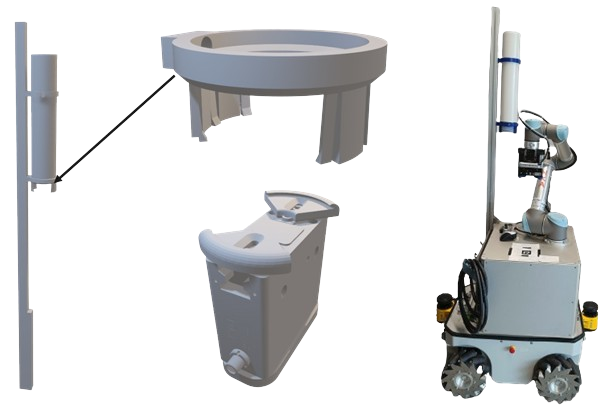

# neobotix_beerpong
This is our main repo for the Neobotix MMO500 platform with an UR5 robot placing beerpong cups on a table. The whole repo was developed by Leo Schäfer, Maurice Droll, Andreas Schmitt, Robin Wolf and Mathias Fuhrer as part of the project work of the robogistics lecture at Karlsruhe University of Applied Sciences by Prof. Dr.-Ing. Christian Wurll.

## Project overview

In this project a ROS2 implementation for the Neobotix MMO500 and the UR5 was set up. The ROS packages are all linked in the [ros2-packages](https://github.com/mathias31415/neobotix_beerpong/tree/main/ros2-packages) folder. A table position can be entered via a web page. The Neobotix platform then moves to this position. The UR-5 then moves over the table with its end effector and captures an image with an Intel Realsense D415. Using an Aruco code on the table, the robot determines the positions for the Beerpong cup pyramid. The UR5 then picks the cups from the cup dispenser and places them in the calculated positions on the table. The Zimmer GEP5010IO-00-A gripper is used here. The CAD files for the cup dispenser, the gripper jaws and the camera holder are stored in the TODO folder. Detailed documentation (in German) can be found here TODO.

## Video
This [YouTube video](https://www.youtube.com/watch?v=gvZ-DCJvOs4) shows the results of our project:

## Software architecture
All ros2 packages of this project are linked in the folder [ros2-packages](https://github.com/mathias31415/neobotix_beerpong/tree/main/ros2-packages).

TODO

## How-To use

TODO
