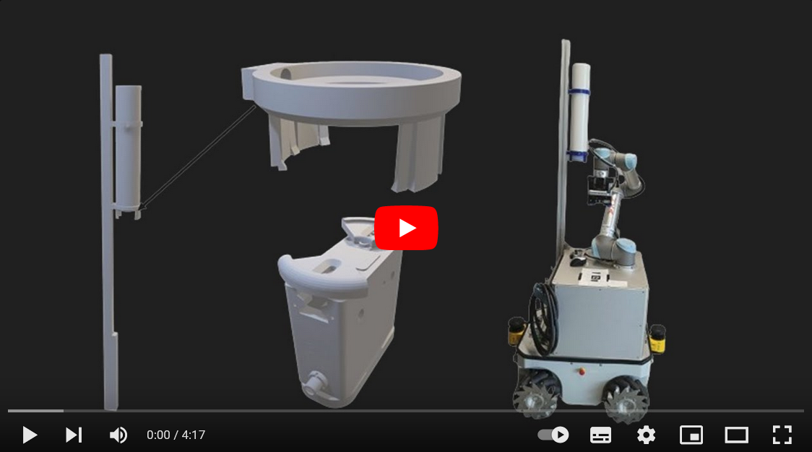

# neobotix_beerpong
This is our main repo for the Neobotix MMO500 platform with a UR5 robot placing beerpong cups on a table. The entire repo was developed by Leo Schäfer, Maurice Droll, Andreas Schmitt, Robin Wolf and Mathias Fuhrer as part of the project work for the robogistics lecture at Karlsruhe University of Applied Sciences by Prof. Dr.-Ing. Christian Wurll.

## Project Overview


In this project, we set up a ROS2 implementation for the Neobotix MMO500 and the UR5. The ROS packages are all located in the [ros2-packages](https://github.com/mathias31415/neobotix_beerpong/tree/main/ros2-packages) folder. A table position can be entered via a web page. The Neobotix platform then moves to this position. The UR-5 then moves over the table with its end effector and captures an image with an Intel Realsense D415. Using an Aruco code on the table, the robot determines the positions for the Beerpong cup pyramid. The UR5 then picks the cups from the cup dispenser and places them in the calculated positions on the table. The Zimmer GEP5010IO-00-A gripper is used for this. The CAD files for the cup dispenser, the gripper jaws and the camera holder are stored in the [cad](https://github.com/mathias31415/neobotix_beerpong/tree/main/cad) folder. Detailed documentation (in German) can be found here TODO.

## Video
This [YouTube video](https://www.youtube.com/watch?v=gvZ-DCJvOs4) showcases the results of our project:

[](https://www.youtube.com/watch?v=gvZ-DCJvOs4)

## Software
All ROS2 packages for this project are located in the [ros2-packages](https://github.com/mathias31415/neobotix_beerpong/tree/main/ros2-packages) folder.

When everything was running on the Neobotix platform PC, all CPUs were fully utilized, which caused problems. As a result, we moved parts of the program to other laptops. The laptops are connected either in a shared Wi-Fi network or via SSH, as shown in the following graphic.


### [docker_website_beerpong](https://github.com/mathias31415/neobotix_beerpong/tree/main/ros2-packages/docker_website_beerpong)
- Hosting the Website
- Python web framework Flask

### [neobotix_coordinator](https://github.com/mathias31415/neobotix_beerpong/tree/main/ros2-packages/neobotix_coordinator)
- Behavior Tree
- High-level control flow
- Includes clients

### [neobotix_mmo500_driver](https://github.com/mathias31415/neobotix_beerpong/tree/main/ros2-packages/neobotix_mmo500_driver)
- Movement of the Neobotix Platform
- Hardware communication: Motors and Lidar scanner
- Initiating navigation and SLAM mapping

### [realsense_driver](https://github.com/mathias31415/neobotix_beerpong/tree/main/ros2-packages/realsense_driver)
- Processing of Aruco Markers
- ROS2 driver for the camera and server for Aruco detection

### [ur_ros2_driver_humble](https://github.com/mathias31415/neobotix_beerpong/tree/main/ros2-packages/ur_ros2_driver_humble)
- Control of the UR5
- Path planning pipeline and IO server
- PTP, LIN, Joint-Space-PTP in MoveIt via MoveGroup interface


## How-To Use
### PC Neobotix
Plug in the display-port cable to a monitor and connect a keyboard and mouse to the neobotix.
Clone/ download the ros2-packages `neobotix_mmo500_driver` and `realsense_driver` and launch them with the following commands:
```
git clone https://github.com/mathias31415/neobotix_beerpong.git
```
Build the Docker images:
```
cd neobotix_beerpong/ros2-packages/neobotix_mmo500_driver
./build_docker.sh

cd neobotix_beerpong/ros2-packages/realsense_driver
./build_docker.sh
```
Start the neobotix driver package:
```
cd neobotix_beerpong/ros2-packages/neobotix_mmo500_driver
./start_docker.sh
```
All the necessary nodes will be launched in autostart. You should now be able to drive the neobotix with the Logitech controller.

### Laptop on the Neobotix
This laptop is placed on the Neobotix platform and connected to it via an Ethernet cable to the UR-Control. Additionally, the laptop is on the same Wi-Fi network as the other laptops. Clone/download the `ur_ros2_driver_humble` ROS2 package and launch it with the following commands:
```
git clone neobotix_beerpong/ros2-packages/ur_ros2_driver_humble
```
Build and run the container:
```
cd neobotix_beerpong/ros2-packages/ur_ros2_driver_humble
./build_ur.sh
./start_ur.sh
```
All the nodes will be started in autostart, and RViz should launch. Select and run the UR-Cap "External Control" on the UR-Teachpad. Now you should be able to control the robot arm via RViz.

### Controller Laptop
Clone/download the `neobotix_mmo500_driver` ROS2 package and launch it. Connect to the Neobotics PC via SSH with the following commands:
```
git clone https://github.com/mathias31415/neobotix_beerpong.git
```
Build and run the Docker images (NOTE: at this point, it is recommended to deactivate your Wi-Fi because it can interfere with the container running on the Neobotix):
```
cd neobotix_beerpong/ros2-packages/neobotix_mmo500_driver
./build_docker.sh
./start_docker.sh
````
Now switch back to the shared Wi-Fi and connect one terminal to the running container:
```
docker exec -it neobotix_mmo500_bringup bash
```
Start RViz visualization for navigation or mapping:
```
ros2 launch neo_nav2_bringup rviz_launch.py
```
At this point, there might not be much visible in RViz. You can check if you can see the Neobotix-hosted nodes in the terminal to verify the connection between the containers.

Open another terminal and connect via SSH to the Neobotix PC:
```
ssh neobotix@172.22.32.11 (password: neobotix)
```
[**]
Connect to the driver container and start the navigation:
```
docker exec -it neobotix_mmo500_bringup bash
ros2 launch neo_mpo_500-2 navigation.launch.py
```
Wait until all lifecycle nodes are up. Now you should see the robot model, map, and costmaps in RViz. After setting the initial pose of the robot in the map, you can use the navigation by publishing Nav2Goals.

If you don't want to use the navigation mode but want to record a new map, switch back to [**], pass the navigation instructions, and follow the mapping instructions: 
Connect to the driver container and start the mapping:
```
docker exec -it neobotix_mmo500_bringup bash
ros2 launch neo_mpo_500-2 mapping.launch.py
```
Now drive the Neobotix with the controller around the area you want to map (Note: only the front scanner is used for mapping). The map will be created step by step, and the process can be viewed in the opened RViz window.

If you are finished, save the map:
Open another terminal, connect via SSH to the Neobotix, and attach it to the running container:
```
ssh neobotix@172.22.32.11 (password: neobotix)
docker exec -it neobotix_mmo500_bringup bash
```
Save the map with your name:
```
ros2 run nav2_map_server map_saver_cli -f ~/ros2_ws/src/neo_mpo_500-2-humble/configs/navigation/maps/<your_map_name_without_file_extension>
```
Once finished, you can close the two terminals and run the navigation with your new map (launch argument map:=<your_map_name.yaml>).

Moreover, you have to start the Realsense camera nodes on the Neobotix. Plug in the USB cable from the camera into an open Neobotix port (Note: the cable has to be outside of the scanner safety field). Open another terminal, connect via SSH to the Neobotix, and start the Realsense container:
```
ssh neobotix@172.22.32.11 (password: neobotix)
cd neobotix_beerpong/ros2-packages/realsense_driver
./start_docker.sh
```
All the nodes should be launched automatically. If you receive the feedback "Realsense Node is up!" in the terminal, everything is fine.

### User Laptop
The instruction readme for the 
Clone/download the `neobotix_coordinator` and `docker_website_beerpong` ROS2 packages and launch them with the following commands:

Build and start the Docker container
```bash
source build_docker.sh
source start_docker.sh
```

Inside the container, launch the Coordinator node with parameters:
```
# in neobotix_coordinator docker

ros2 launch neobotix_coordinator neobotix.launch.py
```
You can then access the website at http://127.0.0.1:8080/ and choose the table.

For further details on how to customize the behavior tree, please refer to the [readme](https://github.com/LeoSc4/neobotix_coordinator/blob/main/README.md) of the `neobotix_coordinator` package.
