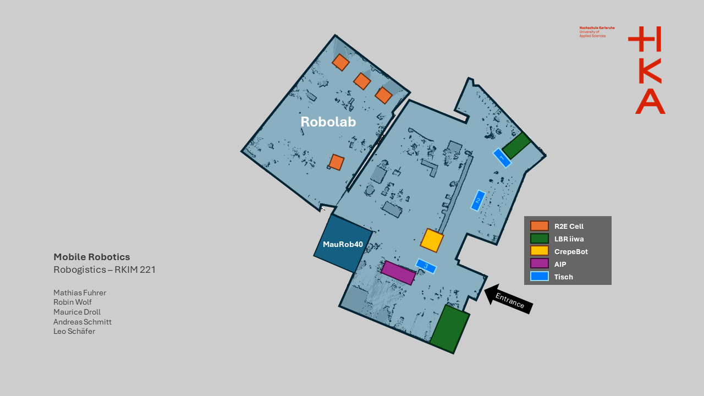

# Image of website

# How to Start the docker

    1. Navigation to the cloned repo on your local system
    2. Open Terminal
    3. Type in the command and press enter:
        source start_docker.sh

# How to Start the website

The website runs with flask and python3.

    1. Navigate to ros2_ws
    2. Colcon build
    3. source install/setup.bash
    4. Navigate to src/pkg_website_beerpong/pkg_website_beerpong
    5. start it with: python3 app.py

# How to access the website

navigate in your browser to: http://127.0.0.1:8080/

# How to request the service /table_server

ros2 service call /table_server select_table_interfaces/srv/TableSelect "{request: True}

# ROS Domain ID
53

# TO- DO

- Autostart via ros2 launch